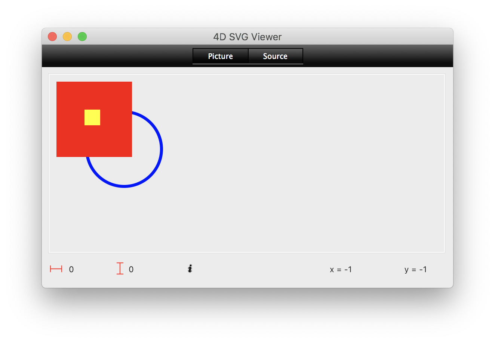

## svg extends the <a href="xml.md">`xml`</a>class
After creating and using the 4D SVG component, I became aware of the need to build a new API much smaller, faster and closer to the SVG format and my use to manage the user interface. 

The goal of this class is to reduce the complexity of code to create and manipulate svg images/documents.
This class will be augmented according to my needs but you are strongly encouraged to participate yourself through pull request.

Using the 4D SVG component to create and manipulate SVG elements requires knowledge of many commands and becomes difficult to understand and maintain. Creating a simple SVG requires many lines of code:

```4d
// Create a new canvas
var $root : Text
$root:=SVG_New
	
// Create a "background" group
var $background : Text 
$background:=SVG_New_group($root)
	
// Create a "foreground" group and apply a translation
var $foreground : Text
$foreground:=SVG_New_group($root)
SVG_SET_TRANSFORM_TRANSLATE($foreground; 45; 45)
	
// Create a yellow square
var $rect : Text
$rect:=SVG_New_rect($foreground; 2.5; 2.5; 20; 20)
SVG_SET_FILL_BRUSH($rect; "yellow")
SVG_SET_STROKE_BRUSH($rect; "yellow")
	
// Add, into the "background" layer, a blue circle without fill & with a border of 4 pixels
var $circle : Text
$circle:=SVG_New_circle($background; 100; 100; 50)
SVG_SET_FILL_BRUSH($circle; "none")
SVG_SET_STROKE_BRUSH($circle; "blue")
SVG_SET_STROKE_WIDTH($circle; 4)
	
// Create a red square
$rect:=SVG_New_rect($background; 10; 10; 100; 100)
SVG_SET_FILL_BRUSH($rect; "red")
SVG_SET_STROKE_BRUSH($rect; "red")
	
// Show the result into teh SVG viewer
SVGTool_SHOW_IN_VIEWER($root)
	
// Do not forget to release the memory !
SVG_CLEAR($root)
```
The `svg` class simplifies the creation and manipulation of the SVG elements thanks to a set of simple functions and some automatisms, and decrease the number of variables needed. Here is the equivalent code to get the same result (<mark>only 8 lines of easily understandable code versus 21 complicated lines with the component</mark>):

```4d
var $svg : cs.svg

// Create a new canvas
$svg:=cs.svg.new()

// Create a "background" group, its address is automatically memorized
// The object will automatically be added to the latest created "container" ("svg")
// The reference is automatically memorized into the store
$svg.group("background")

// Create a "foreground" group and apply a translation
// We must precise the "root" destination else the group will be included into the "background" one
$svg.group("foreground").translate(45; 45).attachTo("root")

// Create a yellow square & memorize its reference as "original"
// The object will automatically be added to the latest created "container" ("foreground" layer)
$svg.square(20).position(2.5; 2.5).color("yellow").push("original")

// Add, into the "background" layer, a blue circle without fill & with a border of 4 pixels
$svg.circle(50).color("blue").translate(100; 100).fill(False).stroke(4).attachTo("background")

// Clone the "original" square, colore it red, change its dimensions & puts it into the "background" layer
$svg.clone("original").color("red").position(10; 10).dimensions(100; 100).attachTo("background")

// Show the result into teh SVG viewer
// The memory is automatically freed
$svg.preview()
```
The svg tree created:

```xml
<?xml version="1.0" encoding="UTF-8" standalone="yes" ?>
<svg xmlns="http://www.w3.org/2000/svg" fill="none" font-family="'lucida grande','segoe UI',sans-serif" font-size="12" preserveAspectRatio="none" shape-rendering="crispEdges" stroke="black" text-rendering="geometricPrecision" viewport-fill="none" xmlns:xlink="http://www.w3.org/1999/xlink">
  <def/>
  <g id="background">
    <circle cx="0" cy="0" fill="none" r="50" stroke="blue" stroke-width="4" transform="translate(100,100)"/>
    <rect fill="yellow" height="100" stroke="yellow" width="100" x="10" y="10"/>
  </g>
  <g id="foreground" transform="translate(45,45)">
    <rect fill="blue" height="20" stroke="blue" width="20" x="2.5" y="2.5"/>
  </g>
</svg>
```
The result image:



## Properties:

|Properties|Type|Description|Initial value|
|---------|----|------|:------:|
|**.root**|Text|The DOM tree reference in memory of the document virtual structure|**Null**|
|**.autoClose**|Boolean|Indicates whether the XML tree should be automatically closed after a call to one of the functions: `exportPicture()`, `exportText()`, `picture()`, `content()`, `save()` or `preview()`|**True\***|
|**.file**|**4D**.File|The disk file of the last `.save()` or `.load()`call|**Null**|
|**.success**|Boolean|Indicates whether a function call was successfully executed|
|**.errors**|Collection|The list of errors encoutered, if so|[ ]|
|**.latest**|Text|The DOM reference of the last element created|**Null**|
|**.image**|Picture|The image generated by the last call to the `picture()` function.|**Null**|
|**.xml**|Text|The SVG tree as text generated during the last call to the `content()` function.|**Null**|
|**.store**|Collection|The element references memorized (see below)|[ ]|

\* **Important**: If `.autoClose` is set to **False** (or if you don't call a function that automatically closes the structure), once you no longer need the structure, remember to call the function `.close()` in order to free up the memory.

## Creation

The class constructor `cs.svg.new()` can be called without parameters to create a default svg structure with these attributes:
>`"viewport-fill"="none"`    
>`"fill"="none"`    
>`"stroke"="black"`    
>`"font-family"="'lucida grande','segoe UI',sans-serif"`    
>`"font-size"=12`    
>`"text-rendering"="geometricPrecision"`    
>`"shape-rendering"="crispEdges"`    
>`"preserveAspectRatio"="none"`

The class constructor also accepts an optional parameter, so you can create a svg structure by passing a 4D.File, a Blob variable or a Text variable.
>```cs.svg.new(4D.file)``` Loads & parses the file content    
>```cs.svg.new(Blob)``` Parses the blob variable content     
>```cs.svg.new(Text)``` Parses the text variable content

## Functions

>* With the exception of functions that return a specific result (getter function), each call returns the original `cs.svg`, and you can include one call after another.

### Drawing functions

>* When a drawing function is called without passing the `attachTo` parameter, the object is added to the last created structure that can be used to add an object. If the `attachTo` parameter is passed, it can be: a DOM reference, an id, the name of a reference stored with the `.push()` function or a reserved name (`"root"`, `"latest"`, `"parent"` or `"append"`).

|Function|Action|
|--------|------|   
|.**line** (x1 : Real; y1 : Real; x2 : Real; y2 : Real {; attachTo }) → cs.svg | To draw a line  
|.**rect** (height : Real {; width : Real } {; attachTo}) → cs.svg | To draw a rectangle
|.**square** (side : Real {; attachTo }) → cs.svg | To draw a square
|.**circle** (radius : Real; cx : Real; cy : Real {; attachTo }) → cs.svg | To draw a circle
|.**ellipse** (radiusX : Real; radiusY : Real; cx : Real; cy : Real {; attachTo }) → cs.svg | To draw a circle  
|.**imageRef** (file : 4D.File {; attachTo }) → cs.svg | To put an image reference (url)        
|.**imageEmbedded** (picture : Picture {; attachTo }) → cs.svg | To embed a picture variable
|.**textArea** (text : Text {; attachTo }) → cs.svg | To create a text area
|.**group** ({ id : Text {; attachTo }}) → cs.svg | To define a group

### Setting functions

>* If a setting function is called, without passing the `target` parameter, before the creation of an object in the canvas, the target is canvas itself, otherwise the target is the last created object. If the `target` parameter is passed, it can be: a DOM reference, an id, the name of a reference stored with the `.push()` function or a reserved name (`"root"`, `"latest"`, `"parent"` or `"append"`).
>* Remember that you can still add unmanaged attributes with the functions `.setAttribute()` or `.setAttributes()` 
>* Remember that you can always use DOM XML commands to manipulate the SVG tree `.root`, object `.latest` or reference retrieved with the `.fetch()` function.

|Function|Action|
|--------|------|
|.**id** (id : Text) → cs.svg | Sets the id of the element
|.**dimensions** ({ width : Real; height : Real {; unit : Text }}) → cs.svg  | Sets the dimensions
|.**position** (x : Real {; y : Variant }{; unit : Text }) → cs.svg | Sets the position
|.**translate** (x : Real; y : Real {; target }) → cs.svg | Apply a translation
|.**moveHorizontally** (x : Real {; target }) → cs.svg | Moves horizontally
|.**moveVertically** (y : Real {; target }) → cs.svg | Moves vertically
|.**scale** (x : Real {; target }) → cs.svg | Apply scaling
|.**color** (color : Text {; target }) → cs.svg | Sets stroke and fill color
|.**opacity** (opacity : Real {; target }) → cs.svg | Sets opacity of stroke and fill
|.**fill** (value (Text \| Boolean \| Object) {; target }) → cs.svg | Sets the fill attributes
|.**fillColor** (color : Text {; target }) → cs.svg | Sets the fill color
|.**fillOpacity** (opacity : Real {; target }) → cs.svg | Sets the fill opacity
|.**stroke** (value (Text \| Boolean \| Real \| Object) {; target : Text }) → cs.svg | Sets the stroke attributes
|.**strokeColor** (color : Text {; target }) → cs.svg | Sets the stroke color
|.**strokeWidth** (width : Real {; target }) → cs.svg | Sets the stroke width
|.**strokeOpacity** (opacity : Real {; target }) → cs.svg | Sets the stroke opacity
|.**font** (attributes : Object {; target }) → cs.svg | Sets the fonts attributes
|.**fontFamily** (fonts : Text {; target }) → cs.svg | Sets the font family
|.**fontSize** (size : Integer {; target }) → cs.svg | Sets the font size
|.**fontStyle** (style : Integer {; target }) → cs.svg | Sets teh font style
|.**alignment** (alignment : Integer {; target }) → cs.svg | Sets the text alignment
|.**textRendering** (rendering : Text {; target }) → cs.svg | Fix the text rendering
|.**setAttribute** (name : Text; value : Variant {; target }) → cs.svg | Sets one attribute
|.**setAttributes** (attributes : Text \| Collection \| Object; value : Variant {; target}) → cs.svg | Defines multiple attributes
|.**setValue** (value : Text {; target }{; CDATA : Boolean }) → cs.svg | Sets the element value
|.**visible** (visible:Boolean {;target }) → cs.svg | Sets object visibility
|.**rounded** (radius : Integer {; target}) → cs.svg | Fix the radius of a rounded rectangle
|.**styleSheet** (file : 4D.File) → cs.svg | Attach a style sheet
|.**class** (class : Text {; target }) → cs.svg | Sets the node class
|.**addClass** (class : Text {; target}) → cs.svg | Add a value to the node class


### Document functions

|Function|Action|
|--------|------|
|.**load**(source : 4D.File \| Text \| Blob {; validate : Boolean {; schema : Text }}) → cs.svg | Loads a SVG tree from a file or a variable (TEXT or BLOB)
|.**picture** ({ exportType : Integer} {; keepStructure : Boolean }) → Picture  | Returns the picture described by the SVG structure & populates the `.image` property if success.
|.**content** ({ keepStructure : Boolean }) → Text  | Returns the SVG tree as text & populates the `.xml` property if success.
|.**exportPicture**(file : 4D.file; keepStructure : Boolean) → cs.svg | Saves the SVG tree as a picture file.
|.**exportText**(file : 4D.file; keepStructure : Boolean) → cs.svg | Writes the content of the SVG tree into a disk file.
|.**close** → cs.svg | Frees the memory taken up by the SVG tree \*
|.**save**({ keepStructure : Boolean }) → cs.svg | Saves the content of the SVG tree into the initially loaded file or the last created file by calling `exportText()`

\* After the execution,`.root`is null but `.image`& `.xml` are always available


### Utilities functions

|Function|Action|
|--------|------|
|.**new**({ attributes : Object }) → cs.svg | Close the current tree if any & create a new svg default structure.
|.**attachTo**(parent : Variant) → cs.svg | Adds item to parent item
|.**push**(name : Text) → cs.svg | Keeps the dom reference into the store associated with the given name
|.**fetch**(name : Text)→dom : Text | Retrieve a stored dom reference associated with the given name
|.**copy**(source : Text {; attachTo}) → cs.svg |To create a copy of a svg object
|.**isOfClass**(class : Text {; target }) → isOfclass : Boolean | Tests if the node belongs to a class
|.**preview**({ keepStructure : Boolean }) | Display the SVG image & tree into the SVG Viewer if the component 4D SVG is available.

### Inherited functions

`findByPath()`     | Searches for one or more elements corresponding to an XPath & returns its reference or a collection if any.
`findById()`       | Searches for the element whose id attribute equals the value passed & Returns its reference, if found.


